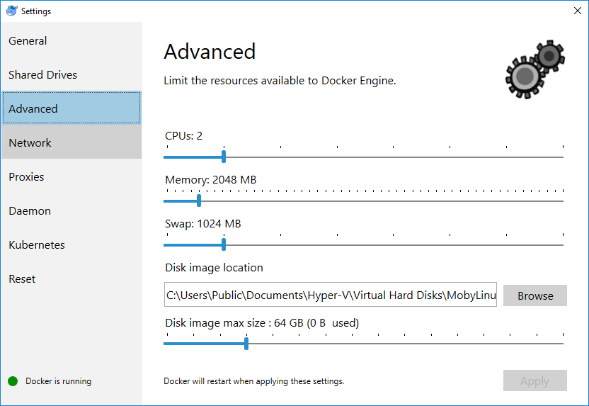
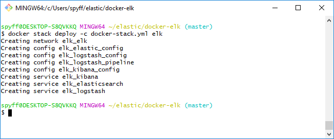
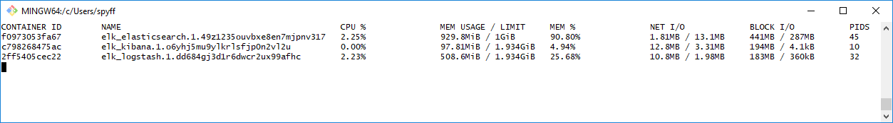
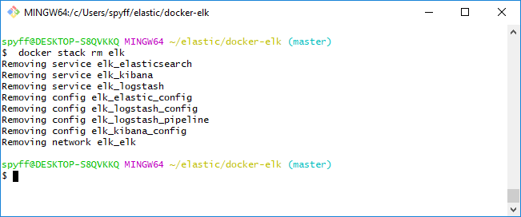

# Elastic stack (ELK) Docker

Eredeti verzió: [https://github.com/deviantony/docker-elk/](https://github.com/deviantony/docker-elk/)
Ez a verzió a fenti docker stack egy módosított változata, hogy fusson Windowson is.

Tartalmazza az Elasticsearch mellett a Logstash-t (Twitter logoláshoz előkészítve) és a Kibana-t amivel lehet vizualizálni az összegyűjtött datokat.
A Logstash és a Kibana service kitörölhető a stack fájlból, ha nincs rájuk szükség, ebben az esetben egy sima Elasticsearch telepítés fog végrehajtódni.

## Előkészítés

Windows 10-en lett tesztelve. Telepíteni kell a Docker-t és a Git-et. A Git feltelepít egy Git bash nevű terminál emulátort is, ebben a leírásban ezt fogjuk használni, de a parancsok kiadhatóak lennének windows terminálból vagy powershellből is, kicsit más szintaxissal.

**Fontos!** A docker futtatáshoz alapvetően nincs szükség rendszergazda jogosultságra. Viszont egyes mappákhoz való hozzáférésre (például ahol szeretnénk tárolni az elasticsearch index adatait) szükség lehet rendszergazdai jogosultságra a hozzáférés egyszeri engedélyezéséhez (erre csak egyszer kérdez rá a rendszer, utána használja a könyvtárat és az alkönyvtárait).

Allítsuk be a Docker beállításokban a felhasználható erőforrás limiteket. Ennyi erőforráson osztozhatnak a konténerek. Kipróbáláshoz szabad 2Gb RAM és 2 CPU mag elég lehet, akár a lenti képen:


## Konfigurálás

Nyissunk egy Git bash-t és navigáljunk olyan mappába, ahol van írási jogosultságunk. Itt klónozzunk le a repo-t:

```
git clone https://github.com/SPYFF/docker-elk-windows.git
```

Még mielőtt elkezdenénk a letöltött verzió konfigurálását, készítsünk egy mappát, ahol majd az elasticsearch az index adatokat tárolhatja. Ennek a mappának később szükség lesz a teljes elérési útjára, ezt a `pwd` paranccsal kérdezhetjük le a mappában. Fontos, hogy a parancs kimenete a Git bash-ben jó formátumban van, eltérhet a linuxos bash vagy windowsos cmd kimeneti formátumától.
Most nyissuk meg szövegszerkesztővel a `docker-stack.yml` fájlt és keressük meg a következő sorokat:

```
volumes:
      - /c/Users/USER/elastic/data:/usr/share/elasticsearch/data
```

Itt a kettőspont előtti részt írjuk át a most létrehozott mappára. **Fontos** hogy a `/usr/share/elasticsearch/data` maradjon, ennek a mappának nem kell léteznie, ez azért szükséges, mert a docker konténerben futó elasticsearch ebben a mappában fogja látni a mi windowson készített mappánk tartalmát.

Ha nincs szükségünk Logstash-re és Kibana-ra, törüljük a `docker-stack.yml` fájlból ezeket a blokkokat:
```
  logstash:
    image: docker.elastic.co/logstash/logstash-oss:6.5.4
    ports:
      - "5000:5000"
      - "9600:9600"
    configs:
      - source: logstash_config
        target: /usr/share/logstash/config/logstash.yml
      - source: logstash_pipeline
        target: /usr/share/logstash/pipeline/logstash.conf
    networks:
      - elk
    deploy:
      mode: replicated
      replicas: 1

  kibana:
    image: docker.elastic.co/kibana/kibana-oss:6.5.4
    ports:
      - "5601:5601"
    configs:
      - source: kibana_config
        target: /usr/share/kibana/config/kibana.yml
    networks:
      - elk
    deploy:
      mode: replicated
      replicas: 1
```

### Twitter konfiguráció (ha szeretnénk használni)

Keressük meg a `logstash/pipeline/logstash.conf` fájlt és nyissuk meg szövegszerkesztővel. A lenti mezőket (`YOUR_CONSUMER_KEY`, `YOUR_CONSUMER_SECTET`, stb.) cseréljük le a saját twitter adatainkkal (ezek a twitter development dashboardon létrehozott applikáció adatai között vannak). 
```
twitter {
        	consumer_key => "YOUR_CONSUMER_KEY"
        	consumer_secret => "YOUR_CONSUMER_SECTET"
        	oauth_token => "YOUR_OAUTH_TOKEN"
        	oauth_token_secret => "YOUR_OAUTH_TOKEN_SECRET"
    
        	keywords => ["innovation", "research", "big data"]
        	full_tweet => false
    	}
```

## Telepítés

Navigáljunk a `docker-elk-windows` mappába (vagy ha más mappába klónoztuk a githubról, akkor oda) és adjuk ki a következő parancsot:

```
docker stack deploy -c docker-stack.yml elk
```

A kimenet ehhez hasonló kell legyen:


Ellenőrizzük, futnak-e konténerek (Elasticsearch konténernek mindenképp futnia kell, a másik kettő opcionális, ha nem töröltük őket a stack fájlból és nincs hiba itt már kell hogy látszódjanak). Ehhez adjuk ki a következő parancsot:
```
docker stats
```
Ehhez hasonló kimenetet kell látnunk:


A szolgáltatások portjai elérhetőek a gépünkön is, nem csak a konténerben. Az elasticsearch a `127.0.0.1:9200`-as címen érhető el (curl), a Kibana elérését pedig tesztelhetjük, ha a böngészőbe beírjuk a `127.0.0.1:5601` címet.

Ha újraindítjuk a számítógépet, a `docker-stack.yml` service-ek ismét elindulnak és folytatják a működésüket. Ha nem töröltük az itt megadott mappát, ebben az új konténer meg fogja találni az elasticsearch indexfájlokat, és folytatja az adatgyűjtést, nem vesznek el az adataink. Ha nincs szükség tovább a konténerekre, töröljük a service-eket a következő paranccsal (egész stacket tölri, a benne lévő service-ekkel együtt)

```
docker stack rm elk
```


**Fontos**: ez a parancs nem fogja törölni az indexfájlokat, azokat manuálisan kell törölni (az elején létrehozott mappát) ha már nincs szükség rájuk. Ez előnyös is lehet, ha később újra telepítjük a stack-et, nem fognak eltűnni az addigi adatok. Az adatokat átmásolva egy másik számítógépre, majd ott a stack-et telepítve szintén látszani fognak elasticsearchben az adatok.

## Lehetséges hibák

Ha az elasticsearch nem tud írni a `docker-stack.yml` fájl `volumes` részében megadott mappába, akkor hibával kilép. Ebben az esetben a konténer futása véget ér, és a service új konténert indít (és ez megy a végtelenségig, crash-loop). Ilyenkor érdemes törölni a stacket a `docker stack rm elk` paranccsal és másik mappát megadni, amihez van jogosultságunk.

Lehetséges, hogy valamelyik szolgáltatlás nem indul el. Ez lehet azért van, mert nincs elegendő memória. Az alap 2Gb elég abban az esetben, ha a Kibana és a Logstash nincs lekorlátozva, az Elasticsearch pedig limitálva lesz 1Gb RAM-ra a stack konfigurációs fájlban. Ha csak 1Gb szabad memóriánk jut a konténerekre, nem biztos hogy elindulnak, érdemes az elasticsearch szekcióban lelimitálni 512Mb RAM-ra konténer számára elérhető memóriát (a Java heap memóriával együtt).

